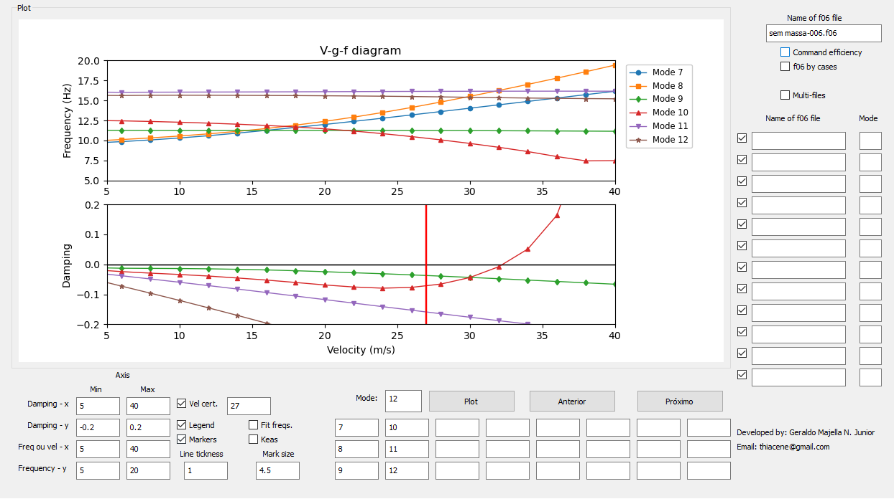

# Nastran SOL 144 and 145 .f06 reader

O programa realiza a leitura do arquivo de saída do nastran (.f06) para as soluções de flutter (SOL145, tanto pelo método por casos (PK) quanto fixo (PKNL)) e de reversão de comandos (SOL144), na qual plota os resultados em uma interface gráfica.
O mesmo possui a capacidade de analisar e comparar multiplos arquivos e varios mecanismos de um único arquivo.

